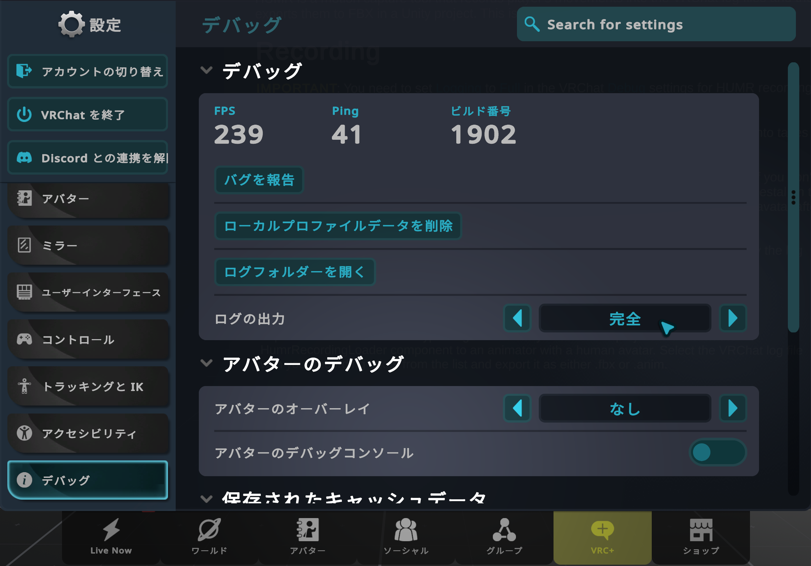

# 録画

[English](Recording.md)

> [!IMPORTANT]
> HUMR で録画するには、VRChat のデバッグ設定でログの出力を元全に設定する必要があります。

カスタムワールドやカスタムアバターで録画するには、[VRChat アカウントを登録](https://vrchat.com/home/register)する必要があります。アップロードには[「New User」以上の Trust Rank](https://docs.vrchat.com/docs/vrchat-safety-and-trust-system#trust-rank)が必要ですが、HUMR の利用に必須とは限りません。この Trust Rank に到達するまでも、ワールドやアバターをローカルでビルドしてテストできます。

[公開ワールド](https://vrchat.com/home/launch?worldId=wrld_1fbb2fea-788e-43a8-a588-8ee7edf8e680)を利用するか、[VRChat ワールドプロジェクト](https://creators.vrchat.com/worlds/)に HumrPlayerRecorder prefab を追加して VRChat にアップロードしてください。公開ワールドは、[Package Manager の Samples タブ](https://vcc.docs.vrchat.com/guides/finding-the-samples#other-package-samples)に HUMR Sample World として収録されています。

Prefab の録画開始・停止ボタンを使って録画を開始・停止します。同じファイルに複数回録画すると、それぞれ Take として分割されます。

録画時とモーション読み込み時に使用するアバターのボーンの長さと回転は、完全に一致している必要があります。VRChat には[多くの公開アバター](https://vrchat.com/home/launch?worldId=wrld_57514404-7f4e-4aee-a50a-57f55d3084bf)がありますが、Unity で正確な `.fbx` ファイルを使用できない場合、録画データの読み込み時に回転が正しく反映されません。

公開ワールドの台座にある HUMR-Chan のサンプルアバターを使用できます。このアバターは VRChat SDK に含まれており、人型アニメーションの録画に適したプロポーションになっています。読み込み後、Unity で別のアバターにアニメーションをリターゲットすることも、[Blender 用 Rokoko プラグイン](https://github.com/Rokoko/rokoko-studio-live-blender/)などのツールを使って手動でリターゲットすることもできます。

VRChat のログは約 1 週間後に削除されるため、それまでに保存したデータを読み込むか、ログファイルをバックアップしてください。

録画後は、アニメーションを読み込めます：[Loading.md](../Loading/Loading.ja.md)
