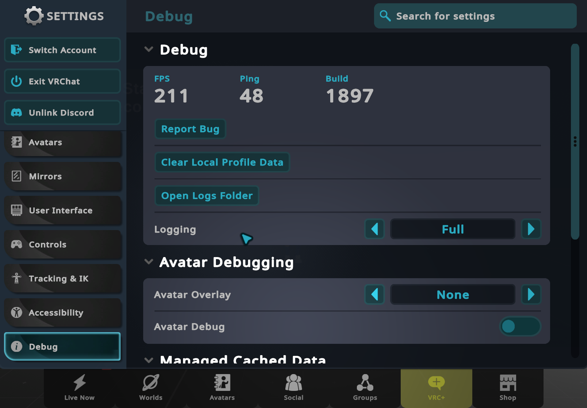
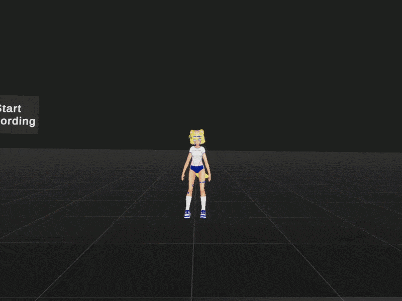

# Recording

> [!IMPORTANT]
> You need to set Logging to Full in the VRChat Debug settings for HUMR recording to work.

To record in a custom world or with a custom avatar, you need to [register a VRChat account](https://vrchat.com/home/register). Uploading requires [a trust rank of "New User" or higher](https://docs.vrchat.com/docs/vrchat-safety-and-trust-system#trust-rank), but you won't necessarily need it for HUMR. You can still locally build and test worlds and avatars until you reach this trust rank.

Either use [the public world](https://vrchat.com/home/launch?worldId=wrld_1fbb2fea-788e-43a8-a588-8ee7edf8e680) or add the HumrPlayerRecorder prefab to your [VRChat World project](https://creators.vrchat.com/worlds/) and upload it to VRChat. The public world is included as HUMR Sample World in [the Samples tab of the Package Manager](https://vcc.docs.vrchat.com/guides/finding-the-samples#other-package-samples).

Use the Start/Stop recording button of the prefab to start and stop recording. Multiple recordings will be split into takes in the same exported file.

The lengths and rotations of the bones of the avatar that you record and load your motion with have to match exactly. VRChat has [a lot of public avatars](https://vrchat.com/home/launch?worldId=wrld_57514404-7f4e-4aee-a50a-57f55d3084bf), but if you don't have the exact .fbx file available in Unity, the recording is going to import with incorrect rotations.

You can use the HUMR-Chan sample avatar from the pedestal in the public world, because she is included in the VRChat SDK. She has good proportions for recording humanoid animations. Unity can retarget the animation to another avatar after you import it, or you can use a tool like [Rokoko plugin for Blender](https://github.com/Rokoko/rokoko-studio-live-blender/) for manual retargeting.

VRChat logs are deleted after about a week, so make sure to load the saved data before that, or back up the log files.

