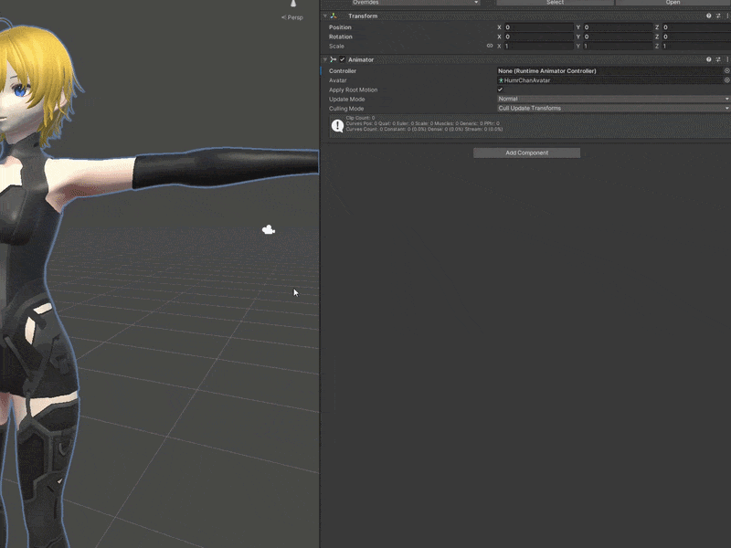

# Hyakuashi Udon Motion Recorder

[日本語](Documentation/README.jp.md)

HUMR is a motion capture tool that records user's movements into the VRChat log files and then reads them in a Unity project. This is version 2, which uses a new log format.

## Installation

> [!WARNING]
> Remove the pre-2.0.0 `HUMR OutputLogLoader` package and `Prefabs`, `ReadMe`, `Scenes` and `Scripts` in `Assets/HUMR` before importing. This is done automatically if installed using VPM.

### Requirements

- [PC version of VRChat](https://store.steampowered.com/app/438100/VRChat/)
- [Unity 2022.3.22f1](https://unity.com/releases/editor/whats-new/2022.3.22f1)
- FBX Exporter =>4.2.1 (Installed automatically on import)
- Timeline =>1.7.7 (Installed automatically on import)
- [VRChat SDK](https://vrchat.com/home/download) =>3.10.0 (To record in a custom world or with a custom avatar)

### VRChat Package Manager

Install from [Sakuu's VPM Listing](https://drsakuu.github.io/vpm-listing/):  (with [ALCOM](https://vrc-get.anatawa12.com/alcom/)).

### Other

For loading recordings, the VRChat SDK is not needed. If you want to do it without VPM, download the `.unitypackage` from [releases](https://github.com/DrSakuu/HyakuashiUdonMotionRecorder/releases) and import it into a Unity 2022.3.22f1 project.

## Usage

### Recording

*Full guide: [Recording.md](Documentation/Recording/Recording.md)*

> [!IMPORTANT]
> You need to set Logging to Full in the VRChat Debug settings for HUMR recording to work.

Either use [the public world](https://vrchat.com/home/launch?worldId=wrld_1fbb2fea-788e-43a8-a588-8ee7edf8e680) or add the HumrPlayerRecorder prefab to your [VRChat World project](https://creators.vrchat.com/worlds/).

### Loading

*Full guide: [Loading.md](Documentation/Loading/Loading.md)*

Add the HumrRecordingLoader Component to an animator with a human avatar. Select the VRChat log file you recorded earlier and export the takes as either .fbx or .anim.

### Advanced guides

Applying the animation to an avatar: [Avatar.md](Documentation/Avatar/Avatar.md)

Recording camera motion: [Camera.md](Documentation/Camera/Camera.md)

## Changelog

[CHANGELOG.md](Documentation/CHANGELOG.md)

## Contributing

[Issues](https://github.com/DrSakuu/HyakuashiUdonMotionRecorder/issues) and [Pull requests](https://github.com/DrSakuu/HyakuashiUdonMotionRecorder/pulls) are welcome! There's already a lot of features planned for [v2.1](https://github.com/DrSakuu/HyakuashiUdonMotionRecorder/issues/2) and [v2.2](https://github.com/DrSakuu/HyakuashiUdonMotionRecorder/issues/3)!

## License

[MIT License](LICENSE.md)
